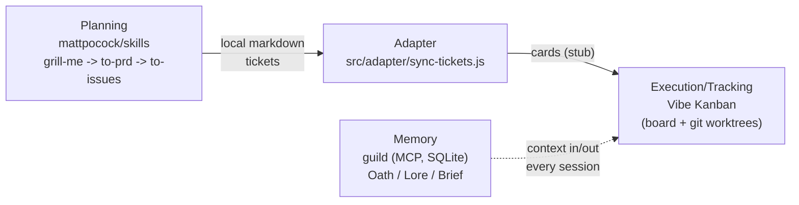

# agentcrew — Product Memory

Durable knowledge about what this product is and why it's built this way.
Load this at the start of every session — it's cheaper than re-deriving from
the code and docs each time.

## What it is

A setup wizard (`node bin/wizard.js setup <path>`) that wires three
independent open-source tools into one workflow for agent-driven engineering.
It is **not** a scaffold for one project — it's a reusable installer, run
once and re-invoked (`agentcrew update`) against every project registered in
`~/.agentcrew/state.json`.

## The three layers and why each was chosen

- **Planning — mattpocock/skills.** `/grill-me` interrogates until no
  ambiguity remains, `/to-prd` writes the destination doc, `/to-issues` cuts
  vertical slices tagged HITL (needs human) or AFK (agent can run solo).
  Chosen explicitly over GitHub's Spec Kit.
- **Execution/tracking — Vibe Kanban.** Board across multiple projects,
  git-worktree isolation per task, launches Claude Code/Gemini/Codex/Cursor
  Agent interchangeably as streamed subprocesses. Its "Needs Attention"
  status is the single queue a user watches.
- **Memory — guild.** Single Go binary, embedded SQLite, MCP server. Oath
  (standing principles, auto-loaded), Lore (decisions/observations, hybrid
  search), Brief (handoff note), Quest (guild's own task board —
  deliberately unused here).

## Load-bearing decisions (don't relitigate these)

1. **Vibe Kanban owns tasks, guild owns memory only.** Never wire
   `quest_accept`/`quest_fulfill` — running two task sources of truth would
   let them disagree. Agents use `guild_session_start`, `lore_appraise`,
   `lore_inscribe`, `quest_brief` only (see `templates/AGENTS.snippet.md`).
2. **Agent-agnostic by design.** The wizard detects installed CLIs
   (`claude`, `gemini`, `codex`, `cursor-agent`) and leaves the actual
   per-task choice to Vibe Kanban — it doesn't hardcode one.
3. **Planning → board bridge is explicit, not magic.** `/to-issues` doesn't
   natively support Vibe Kanban as a tracker (only GitHub/GitLab/local
   markdown). Rather than trust its freeform "Other tracker" path, tickets
   stay on local markdown and `src/adapter/sync-tickets.js` converts them to
   Vibe Kanban cards via MCP.
4. **Install everything from scratch, by explicit user choice** — not
   "detect and install only what's missing."
5. **Some steps are deliberately manual**, not automation gaps:
   `/setup-matt-pocock-skills` and `/grill-me` need an LLM's judgment;
   registering guild as an MCP server inside Vibe Kanban happens in its UI,
   not a file this wizard should edit blind.

## Known unfinished/unverified

- `src/adapter/sync-tickets.js`: `createCard()` is a stub behind
  `--dry-run`. The MCP tool name it assumes (`vk_create_card`) is
  **unconfirmed** — verify against `npx vibe-kanban --mcp`'s real tool list
  before implementing it for real.
- Nothing has been tested against a real running Vibe Kanban or guild
  install — only syntax-checked and dry-run tested.
- Idempotency of guild's `init` and the skills installer on re-run is
  assumed, not verified (the AGENTS.md merge step *is* verified idempotent).

## Repo map

| Path | Role |
|---|---|
| `bin/wizard.js` | CLI entry: `setup <path>`, `update` |
| `src/lib/` | shell exec helpers, state registry (`~/.agentcrew/state.json`), prompts |
| `src/steps/` | one file per setup step (prereqs, detect agents, install guild/skills, check vibe-kanban, merge AGENTS.md) |
| `src/adapter/sync-tickets.js` | local-markdown-ticket → Vibe Kanban card adapter (stub) |
| `templates/AGENTS.snippet.md` | guild/Vibe-Kanban boundary instructions merged into onboarded repos |
| `docs/HANDOFF.md` | original design-session handoff (full reasoning trail; this file is the day-to-day summary) |
