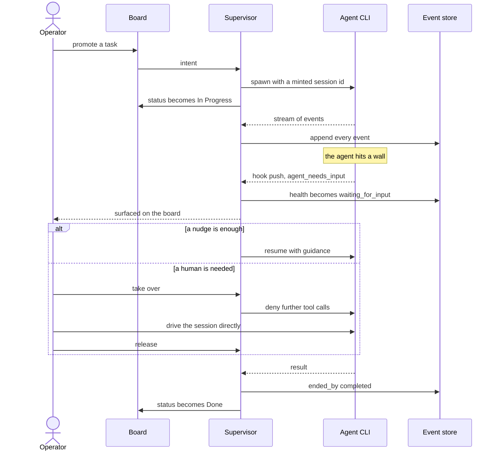
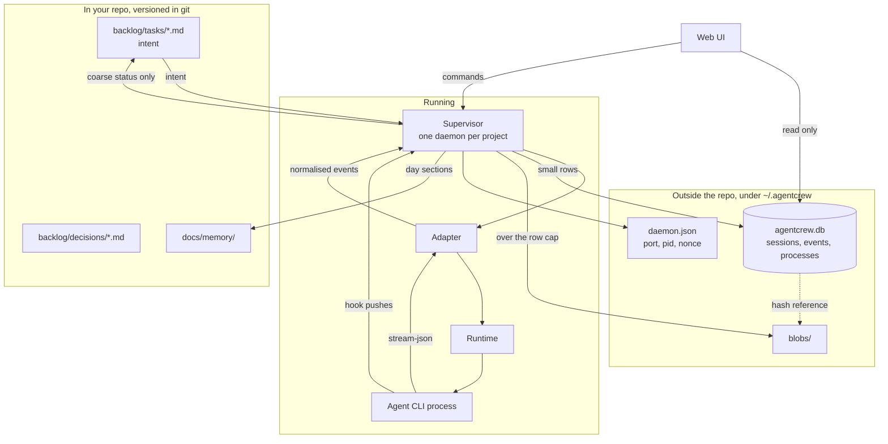
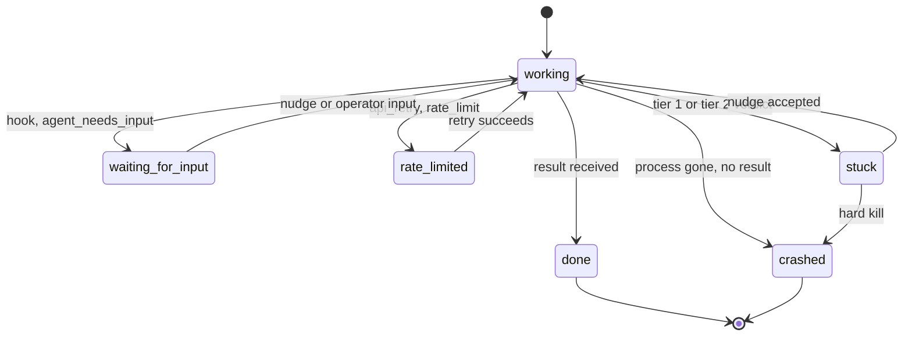
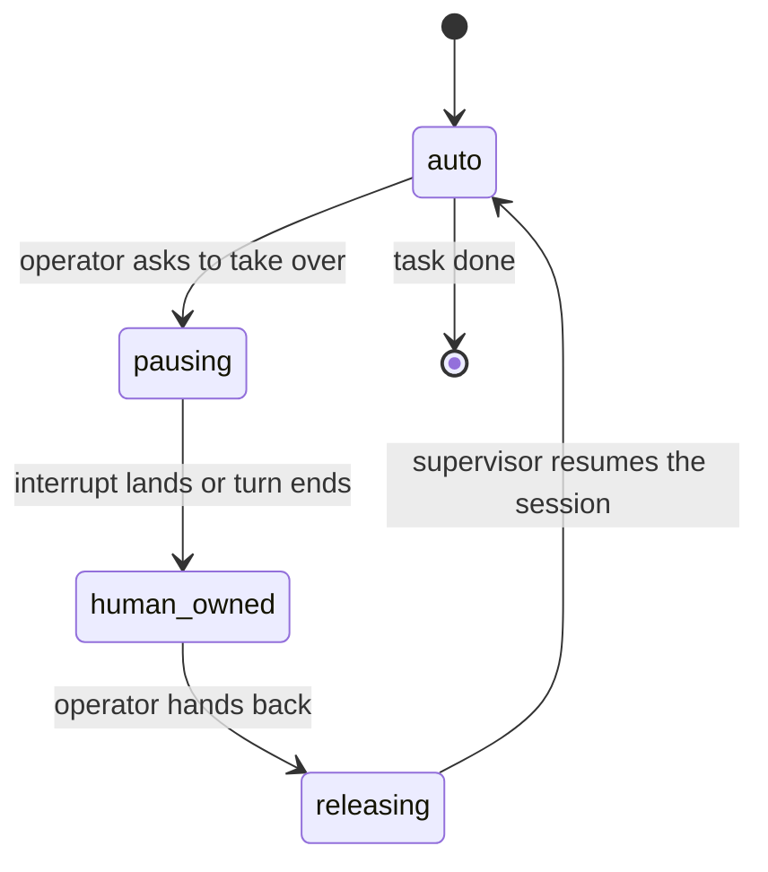

# agentcrew — Product Specification

Normative. Where this document and a task disagree, this document wins. Where
this document and a `backlog/decisions/` record disagree, the decision wins and
this document is wrong and should be fixed.

Section numbers are stable. Tasks cite them as `PRODUCT.md §5.1`.

Status: the installer described in §1.1 exists. Everything from §4 onward is
specified and not yet built.

---

## 1. Purpose and scope

### 1.1 What agentcrew is

Two halves, one product.

| Half | State | Does |
|---|---|---|
| Installer | built | `agentcrew setup <path>` gives a repo a board, a memory layer, a planning loop and one rules file |
| Supervisor | specified | owns agent sessions: spawns them, streams them, archives them, watches their health, and hands them to a human on demand |

The supervisor exists for one reason: **a person must be able to take over a
running agent session**. Everything else follows from that.

### 1.2 Non-goals

- Not a model router. agentcrew never sees a prompt's response before the CLI does.
- Not a hosted service. No account, no server, no telemetry.
- Not a replacement for the agent CLIs. It drives them; it does not reimplement them.
- Not a multi-user system. One machine, one operator. Sharing a session or an endpoint is out of scope and forbidden by §14.2.
- Not a CI runner. `agentcrew doctor` reports; it does not orchestrate pipelines.

---

## 2. Use cases

### 2.1 Primary: a task driven to done, with a takeover

The case the product is designed around. Every other requirement is derived
from a step in it.



### 2.2 Unattended run

Operator is away. A task runs, gets stuck, is nudged once by the supervisor,
recovers, and finishes. The operator reads the transcript later and sees the
nudge in the timeline with what triggered it.

### 2.3 Post-mortem

A task failed overnight. The operator opens the session and asks: what did the
agent run, what did it cost, what killed it, and why. Answerable entirely from
the store, without re-running anything. Requires §5.3 and §5.4.

### 2.4 Multiple projects at once

Two repos, two daemons, two databases, two UI ports, one operator. Neither can
corrupt the other. Requires §8.5.

---

## 3. Vocabulary

| Term | Means |
|---|---|
| **Task** | a unit of intent, a markdown file on the board |
| **Session** | one conversation with one agent CLI, identified by a UUID agentcrew mints |
| **Turn** | one request/response cycle inside a session |
| **Event** | an immutable record of something that happened, §5 |
| **Adapter** | the code that knows one CLI's flags and output format, §9 |
| **Runtime** | the code that knows how to start and kill a process somewhere, §10 |
| **Health** | the supervisor's current belief about a session, §6 |
| **Takeover** | transfer of control of a live session to a human, §7 |
| **Operator** | the human running agentcrew. Singular by design |

---

## 4. Architecture

### 4.1 Components



### 4.2 Two axes

`adapter` answers *which CLI*. `runtime` answers *where it runs*. They are
independent and must never be conflated.

| Axis | v1 | Later |
|---|---|---|
| adapter | `claude`, `agy`, `gemini`, `mock` | any CLI with a streaming JSON mode |
| runtime | `local` | `worktree`, `docker`, `ssh` |

A new CLI must not require a runtime change. A new runtime must not require an
adapter change. §12.3 enforces this with one shared contract suite.

### 4.3 Direction of flow

Intent goes one way: board to session. Only coarse status returns, written by
exactly one writer. The board and the runtime therefore cannot disagree about
what is being worked on.

---

## 5. Event model

### 5.1 Envelope

Every event is one JSON object. Keys are `snake_case`. All timestamps are ISO
8601 UTC with milliseconds.

```json
{
  "id": "evt_01JC2K8X7P0000000000000000",
  "session_id": "6f1e2a70-3f2c-4a1e-9f6b-2d5c8a1b0e33",
  "task_id": "task-4",
  "seq": 17,
  "ts": "2026-09-19T16:40:12.412Z",
  "type": "tool.requested",
  "actor": "agent",
  "caused_by": "evt_01JC2K8X6M0000000000000000",
  "payload": {}
}
```

| Field | Rule |
|---|---|
| `id` | unique, lexicographically sortable, prefix `evt_` |
| `session_id` | the UUID agentcrew minted and passed to the CLI, §9.2 |
| `task_id` | board task id, or `null` for sessions not tied to a task |
| `seq` | integer, starts at 1, monotonic per session, no gaps |
| `ts` | when the supervisor observed it, not when the CLI claims it happened |
| `type` | from §5.2 only. Unknown types are rejected, not stored |
| `actor` | one of `supervisor`, `agent`, `human`, `watchdog`, `schedule` |
| `caused_by` | the `id` of the event that caused this one, or `null` for a root |
| `payload` | type-specific, §5.2. Must obey the row cap, §8.4 |

### 5.2 Event types

Namespaced `noun.verb`. This list is closed; adding a type is a spec change.

| Type | Payload carries |
|---|---|
| `session.started` | `adapter`, `runtime`, `cwd`, `argv`, `capabilities` |
| `session.resumed` | `resumed_from_seq` |
| `session.ended` | `ended_by` per §5.3 |
| `turn.started` | `turn_index` |
| `turn.ended` | `turn_index`, `cost_usd`, `tokens` |
| `message.user` | `text`, `source` (`operator`, `supervisor`, `nudge`) |
| `message.assistant` | `text` |
| `tool.requested` | `tool_name`, `tool_input`, `tool_use_id` |
| `tool.completed` | `tool_use_id`, `result_ref`, `duration_ms` |
| `tool.failed` | `tool_use_id`, `error` |
| `permission.requested` | `tool_name`, `tool_input` |
| `permission.decided` | `decision` (`allow`, `deny`), `reason`, `decided_by` |
| `health.changed` | `from`, `to`, `tier`, `evidence` per §6.2 |
| `nudge.sent` | `text`, `tier`, `verdict` |
| `takeover.requested` | — |
| `takeover.acquired` | — |
| `takeover.released` | — |
| `process.spawned` | `pid`, `nonce`, `argv`, `cwd` |
| `process.exited` | `exit_code`, `term_signal`, `ended_by` per §5.3 |
| `error.raised` | `scope`, `message` |

### 5.3 Causality

Two required cause records. Neither can be reconstructed later, so both ship
in the first schema.

```json
"started_by": { "reason": "nudge",     "actor": "watchdog", "caused_by": "evt_…" },
"ended_by":   { "reason": "completed", "actor": "agent",    "caused_by": "evt_…" }
```

| Field | Allowed values |
|---|---|
| `started_by.reason` | `operator_action`, `schedule`, `nudge`, `takeover`, `retry`, `hook`, `parent_tool_use` |
| `ended_by.reason` | `completed`, `interrupted_by_operator`, `interrupted_by_supervisor`, `timeout_watchdog`, `killed_tree`, `crashed`, `quota_exhausted`, `daemon_shutdown`, `orphan_reaped` |

The debugging view (§11.3) is a walk up `caused_by`. That chain is the feature.

### 5.4 Process records

Never poll `ps`. Authoritative sources, in order:

1. `PostToolUse` and `PostToolUseFailure` hooks give exact command and outcome.
2. The CLI's own report that it killed a command tree on termination.
3. One best-effort process-tree snapshot taken at kill time only, for the orphan check.

---

## 6. Health model

### 6.1 States



`stuck` is never inferred from elapsed time alone. Time only triggers a check.

### 6.2 Detection tiers

Cheapest first. Each tier escalates to the next only on suspicion.

| Tier | Signal | Cost | Verdict |
|---|---|---|---|
| 0 | hook push: `agent_needs_input`, `permission_prompt`, `idle_prompt`, `Stop`, `SessionEnd` | zero | authoritative |
| 1 | identical `tool_input` 3 times consecutively; or 5 consecutive turns with no file change | zero | authoritative for the loop case, suspicion otherwise |
| 2 | LLM watchdog reads the last 50 events, returns `{verdict, confidence, nudge_text}` | one call | advisory |
| 3 | wall clock: no event for 15 minutes | zero | trigger for tier 2, never a verdict |

Every verdict is written as `health.changed` with `tier` and `evidence`, so
thresholds can be tuned from recorded history rather than guessed twice.

### 6.3 Timing constraints

| Setting | Value | Why |
|---|---|---|
| `CLAUDE_CODE_PRINT_BG_WAIT_CEILING_MS` | `300000` (5 min), set by the supervisor | the CLI's own background wait must finish well inside our watchdog window |
| tier 3 watchdog | 900000 (15 min) | safely above the above |
| tier 2 watchdog call timeout | 60000 (60 s) | one-shot, stateless, hard-capped |

The supervisor sets the environment variable explicitly rather than relying on
its default, so the two timers can never invert.

### 6.4 Hook channel

Hooks are the tier 0 transport. Rules:

- A hook writes one line to the daemon and exits. It performs no work, because the CLI blocks on it.
- Transport is an HTTP POST to the daemon's loopback port from `daemon.json`, carrying the nonce. Chosen over a unix socket because §14.1 requires Windows parity.
- A hook failure must never fail the session. Non-zero exit is logged, not propagated.
- **`--bare` is forbidden for supervised sessions**: it skips hook discovery and silently removes this entire tier.

---

## 7. Takeover protocol

### 7.1 States



Each transition writes the matching `takeover.*` event with `actor: human`.

### 7.2 Enforcement

While `human_owned`:

- The supervisor sends no input. This is enforced, not trusted: the `PreToolUse` hook returns `permissionDecision: "deny"` for every call, with a reason naming the operator.
- `pausing` has a 10 second budget. If the interrupt has not landed, escalate to §7.3 level 3.

### 7.3 Interrupt levels

| Level | Mechanism | Portable | Effect |
|---|---|---|---|
| 1 soft freeze | `PreToolUse` deny | yes | turn lives, agent cannot act |
| 2 end turn | in-band interrupt if `system/init.capabilities` advertises it, else `SIGINT` | POSIX only for the fallback | turn ends, session resumable |
| 3 hard kill | POSIX: `SIGTERM` to the process group, `SIGKILL` after 5 s. Windows: `taskkill /PID <pid> /T /F` | yes, per-OS | process gone, session resumable by id |

Level 3 lives in the runtime layer (§10), never in an adapter. Feature-detect
level 2 from the capabilities array; never compare version strings.

---

## 8. Storage

### 8.1 Locations

Nothing the supervisor writes lives inside the project, because `git clean
-xdf` deletes it.

```text
~/.agentcrew/
  state.json                     existing installer registry, unchanged
  projects/<project-id>/
    agentcrew.db                 SQLite, WAL
    daemon.json                  port, pid, nonce, started_at
    daemon.lock                  advisory lock, one daemon per project
    blobs/<aa>/<sha256>          content addressed
    archive/<session_id>.jsonl.gz  retired events
```

### 8.2 Project identity

A UUID v4 in `.git/agentcrew-project-id`, one line, newline terminated.

| Property | Why this location |
|---|---|
| survives `git clean -xdf` | git never cleans `.git/` |
| moves with the directory | history is not orphaned by a rename |
| distinct per clone | two checkouts do not share a database |
| never committed | a clone cannot inherit someone else's id |

Resolve through `git rev-parse --git-common-dir` so worktrees map to their
parent rather than minting new ids. Non-git folders fall back to
`.agentcrew-project-id` in the folder plus the absolute path.

### 8.3 Tables

```sql
CREATE TABLE sessions (
  id           TEXT PRIMARY KEY,
  task_id      TEXT,
  adapter      TEXT NOT NULL,
  runtime      TEXT NOT NULL,
  cwd          TEXT NOT NULL,
  started_at   TEXT NOT NULL,
  ended_at     TEXT,
  health       TEXT NOT NULL,
  takeover     TEXT NOT NULL DEFAULT 'auto',
  started_by   TEXT NOT NULL,
  ended_by     TEXT,
  last_seq     INTEGER NOT NULL DEFAULT 0,
  archived     INTEGER NOT NULL DEFAULT 0
);

CREATE TABLE events (
  session_id   TEXT NOT NULL,
  seq          INTEGER NOT NULL,
  id           TEXT NOT NULL UNIQUE,
  ts           TEXT NOT NULL,
  type         TEXT NOT NULL,
  actor        TEXT NOT NULL,
  caused_by    TEXT,
  payload      TEXT NOT NULL,
  PRIMARY KEY (session_id, seq)
);
CREATE INDEX events_by_type ON events (type, ts);

CREATE TABLE processes (
  id           TEXT PRIMARY KEY,
  session_id   TEXT NOT NULL,
  parent_id    TEXT,
  kind         TEXT NOT NULL,
  pid          INTEGER,
  nonce        TEXT NOT NULL,
  argv         TEXT NOT NULL,
  cwd          TEXT NOT NULL,
  started_at   TEXT NOT NULL,
  started_by   TEXT NOT NULL,
  ended_at     TEXT,
  exit_code    INTEGER,
  term_signal  TEXT,
  ended_by     TEXT
);
```

`kind` is one of `agent`, `watchdog`, `hook`, `tool_bash`.

**SQLite access is `node:sqlite`, built into Node.** No dependency is added.
This raises the floor to Node >= 22, which is a deliberate trade recorded in
§14.3.

### 8.4 Row cap, blobs, retention

| Rule | Value |
|---|---|
| row cap | a serialised `payload` over 8 KiB spills to a blob |
| spilled payload becomes | `{"blob": "sha256:…", "bytes": N, "preview": "first 200 chars"}` |
| blob path | `blobs/<first 2 hex>/<full sha256>` |
| retention | a session closed more than 30 days ago has its events written to `archive/<session_id>.jsonl.gz` and deleted from `events`; the `sessions` row is kept forever with `archived = 1` |

Archived, never deleted. Same principle as the memory layer.

### 8.5 Daemon and concurrency

- One daemon per project. A crash takes one board down, not all of them.
- The daemon is the **sole writer**. The UI reads.
- Port is chosen from the ephemeral range at startup and written to `daemon.json` with the pid and a fresh nonce.
- `daemon.lock` is taken at startup. A second daemon for the same project exits with a message naming the running pid.
- On startup, reconcile: any session row with `health = 'working'` whose process nonce is gone becomes `crashed` with `ended_by.reason = 'orphan_reaped'`. **Check the nonce, never the pid alone**, because pids are reused.
- A missing project path marks the registry entry `unreachable`. Never auto-delete. The UI offers relocate, or delete behind a typed confirmation.

---

## 9. Adapters

### 9.1 Interface

CommonJS, matching the existing codebase. One module per CLI in
`src/adapters/`, each exporting a factory:

```js
/**
 * @param {object} opts
 * @param {string} opts.sessionId  UUID agentcrew minted
 * @param {string} opts.cwd
 * @param {string} [opts.resumeFrom]  session id to resume
 * @param {object} opts.runtime     a §10 runtime
 * @returns {Adapter}
 */
function createAdapter(opts) {}
```

An `Adapter` exposes:

| Member | Contract |
|---|---|
| `start(prompt)` | spawns and returns once `session.started` has been emitted |
| `send(text, source)` | queues a user message; resolves when acknowledged |
| `interrupt(level)` | 1, 2 or 3 per §7.3; resolves when the level has taken effect |
| `stop(reason)` | ends the session, writing `ended_by` |
| `events` | async iterable of §5.1 envelopes, already normalised |
| `capabilities` | array from `system/init`, empty if the CLI reports none |

Adapters **normalise**. They never write to the store, never decide health,
and never touch the board. An adapter that cannot express something in §5.2
emits `error.raised` rather than inventing a type.

### 9.2 Session identity

agentcrew mints a UUID v4 and passes it as `--session-id`. Resume passes the
same id to `--resume`. **No message hashing, ever** — it was only ever a
workaround for a stateless endpoint that no longer exists in this design.

### 9.3 Supported CLIs

| Adapter | Flags relied on | Status |
|---|---|---|
| `claude` | `-p`, `--session-id`, `--resume`, `--input-format stream-json`, `--output-format stream-json`, `--replay-user-messages`, `--permission-mode`, `--permission-prompts` | first, verified against real builds |
| `agy` | same shape | second, fixtures must be recorded before it is called supported |
| `gemini` | same shape | kept for locked-down corporate machines; **ships marked unverified** until a real session is recorded |
| `mock` | none | a shipped feature, §12.5, not only a test fixture |

---

## 10. Runtimes

One module per runtime in `src/runtime/`. v1 ships `local` only.

```js
/**
 * @returns {{ pid:number, nonce:string, stdin:Writable, stdout:Readable,
 *             stderr:Readable, kill(level:number):Promise<void>,
 *             wait():Promise<{exitCode:number|null, signal:string|null}> }}
 */
function spawn({ argv, cwd, env }) {}
```

`kill` implements §7.3 level 3 per OS. On POSIX the child is spawned detached
so the whole process group can be signalled; on Windows `kill` shells out to
`taskkill /T /F`. Everything above this layer is OS-agnostic.

---

## 11. UI surfaces

Three screens. The mockup (`task-10`) specifies all three before anything is
built, so the event model is designed against real screens.

### 11.1 Board

| Must show | Notes |
|---|---|
| one row per task | board status plus session health side by side |
| health badge | all six states of §6.1, visually distinct |
| stuck rows | why it was flagged, the tier, and the proposed nudge |
| takeover state | `auto`, `human_owned` and the two transitional states |
| last activity | relative time, from the last event |

### 11.2 Session

| Must show | Notes |
|---|---|
| transcript | user and assistant messages in order |
| tool calls | name, input summary, duration, outcome |
| permission requests | including what was decided and by whom |
| nudges | inline in the timeline, marked as supervisor or watchdog |
| cost | per turn and session total, as reported by the CLI |
| controls | take over, release, interrupt at level 1, 2 or 3 |

### 11.3 Forensics

| Must show | Notes |
|---|---|
| process list | every process, its `kind`, and its lifetime |
| cause chain | walk up `caused_by` from any event to its root |
| start and end reasons | `started_by` and `ended_by` in full |

### 11.4 Presentation rules

- Server-rendered or static HTML plus vanilla JS. No framework, no build step, consistent with the zero-dependency stance.
- Readable at 1280 wide. Mobile is out of scope.
- Every timestamp shown relative, with the absolute value on hover.
- Never render raw blob content inline. Show the preview and a link.
- A page opened from `file://` cannot `fetch` a sibling JSON file; browsers block it. Sample data for the mockups is therefore a **JavaScript** file assigning `globalThis.SAMPLE_EVENTS`, loaded with a plain `<script src>`. This keeps "no build step" literally true.

---

## 12. Testing and CI

### 12.1 Rules

- Test runner is `node:test`. CI is `node --test`. No dependency is added.
- **No vendor credential ever enters CI.** Not in a secret, not in an environment, not behind a gate.
- Every mock behaviour traces to a line in a recorded fixture. A mock written from documentation only confirms your own assumptions.

### 12.2 Layout

```text
test/
  fixtures/streams/<name>.jsonl     recorded real sessions
  fixtures/events/<name>.json       hand-written, schema-seeding
  fakes/bin/<adapter>.js            fake CLI binaries
  contract/adapter.test.js          the shared suite of §12.3
  unit/**.test.js
```

### 12.3 Adapter contract suite

Every adapter passes the same suite, against its fake binary. Adding a CLI
means making it green, not editing it.

1. minted session id appears in `session.started`
2. resume continues the same session and `seq` does not restart
3. interrupt level 2 ends the turn and leaves the session resumable
4. interrupt level 3 leaves no orphan processes
5. a malformed output line raises `error.raised` and does not crash the parser
6. every emitted event validates against the §5.1 schema

Runs on ubuntu and windows. Both are required, because §7.3 genuinely diverges.

### 12.4 Required fixtures

Four recorded streams, because these are the paths that break: a rate-limit
retry storm, an `agent_needs_input` stop, a crash mid-turn, and a tool-call
loop.

### 12.5 Drift detection

| Where | What |
|---|---|
| in CI, no credentials | install the real CLIs and assert from `--version` and `--help` that every flag in §9.3 still exists with the same accepted values |
| on a maintainer's machine | `npm run record:fixtures` re-records against real CLIs and commits the result; CI validates the fixtures against §5.1 |

A refreshed fixture that fails schema validation is the vendor announcing a
change. Fixture refresh is on the release checklist; that is the accepted cost
of keeping secrets out of the pipeline.

### 12.6 Determinism

Clock, id generation and filesystem root are injected. Watchdog tests run in
virtual time. No test sleeps.

---

## 13. Repo layout and conventions

```text
src/adapters/     claude.js  agy.js  gemini.js  mock.js
src/runtime/      local.js
src/supervisor/   session.js  health.js  takeover.js  store.js  blobs.js  hooks.js
src/ui/           server.js  public/
mockups/          board.html  session.html  forensics.html  sample-events.json
test/             per §12.2
```

| Convention | Rule |
|---|---|
| modules | CommonJS, matching the existing code |
| style | single quotes, 2-space indent, semicolons |
| comments | JSDoc blocks explaining *why*, as in `src/daemon/tasks.js` |
| dependencies | none. A proposed dependency is a spec change |
| naming | `snake_case` in stored data and JSON, `camelCase` in JavaScript |

---

## 14. Constraints that do not bend

### 14.1 Windows parity

Every feature works on Windows and Linux. Where the mechanism differs it is
isolated in the runtime layer (§10) and both paths are tested (§12.3).

### 14.2 Credentials

agentcrew never handles, stores, forwards or proxies a vendor credential. The
official binaries authenticate themselves. No endpoint is exposed, so there is
nothing to share. See `decision-2`.

### 14.3 Dependencies

Zero runtime dependencies. This forces `node:sqlite`, which raises the
supported floor to **Node >= 22**. The trade is deliberate: a hard floor is
cheaper than a native module that must be rebuilt per platform and that a
locked-down machine may refuse to compile.

### 14.4 The selection criterion

No login wall, no hosted component in the critical path, data in a format we
own, and it still works if the maintainer disappears tomorrow. A dependency
that fails this is rejected regardless of merit.

---

## 15. Open decisions

Listed so nobody has to guess whether an omission is deliberate.

| # | Question | Default if unanswered |
|---|---|---|
| 15.1 | Which model backs the tier 2 watchdog | the operator's configured API key; the feature degrades to tiers 0, 1 and 3 when absent |
| 15.2 | Whether the UI is bundled into the daemon or a separate process | bundled in v1; separated when a second project view is needed |
| 15.3 | Whether `agentcrew update` bumps the Node floor for already-onboarded repos | it warns and does not fail |
