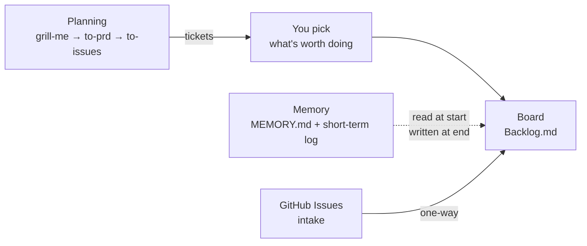

# agentcrew

A setup wizard that turns any git repo into one an agent can work
autonomously — a task board, a memory layer, and a planning loop, wired
together and installed with a single command.



## The rule everything here follows

**No login walls. No hosted services in the critical path. Your data in a
format you own.**

This project previously used a board that required an account for local
issue tracking, then shut down. It was open source — that wasn't enough.
The question that matters is *"can this take my data with it when it dies?"*

Everything here is markdown in your own repo. If every tool in this stack were
abandoned tomorrow, you would lose some nice terminal UIs and keep every task,
decision, and note.

## What gets installed

| Layer | Tool | Where your data lives |
|---|---|---|
| Board | [Backlog.md](https://github.com/MrLesk/Backlog.md) | `backlog/tasks/*.md` |
| Memory | plain markdown | `docs/memory/` |
| Decisions | `backlog decision` | `backlog/decisions/*.md` |
| Planning | [mattpocock/skills](https://github.com/mattpocock/skills) | `.scratch/<feature>/` |

No database. No server. No account.

## Prerequisites

- git, Node.js ≥ 18, npm
- macOS, Linux, or Windows

## Quickstart

From inside the project you want to onboard:

```bash
npx github:inegmdev/agentcrew setup .
```

That's it. No clone, no npm account, nothing to publish — npx fetches
straight from the public repo and runs it.

If you'll use it often, install it once and drop the `npx`:

```bash
npm install -g github:inegmdev/agentcrew

agentcrew setup .        # onboard the project you're standing in
agentcrew update         # re-apply to every project you've onboarded
agentcrew daemon .       # watch the board, keep memory current
```

Onboard as many projects as you like — `update` walks all of them.

## What `setup` does

1. Checks prerequisites and detects which agent CLIs you have (`claude`,
   `gemini`, `kimi`, `codex`, `cursor-agent`).
2. Installs Backlog.md and runs `backlog init`, which writes `CLAUDE.md`,
   `AGENTS.md`, and `GEMINI.md`. Adds a **`Needs Attention`** status — the one
   column that means "a human is needed", whether the work finished or got
   stuck.
3. Scaffolds the memory layer under `docs/memory/`: `MEMORY.md`,
   `MEMORY_SHORTTERM.md`, and `archived/`. A pre-0.5 layout is migrated in
   place — `docs/MEMORY.md` moves, and old `memory/*.md` logs become archived
   sessions.
4. Merges the agentcrew block into `AGENTS.md`, and reduces `CLAUDE.md` and
   `GEMINI.md` to a one-line redirect to it. One file holds the rules, so
   three copies can't drift apart. Rules you wrote by hand in either file are
   folded into `AGENTS.md` first — nothing is dropped.
5. Installs the planning skills.
6. Registers the project in `~/.agentcrew/state.json`.

Every step is idempotent. Re-running never duplicates a block, never
overwrites an existing `MEMORY.md`, never deletes a log, and never touches
your tasks.

## One rules file

```text
AGENTS.md   ←  every rule lives here
CLAUDE.md   →  "All agent rules live in @AGENTS.md — read that file."
GEMINI.md   →  same one-liner
```

Claude Code and Gemini CLI both expand an `@file` reference, so the redirect
loads the real rules rather than hoping the agent follows a hint. Editing
`AGENTS.md` changes what every agent reads.

## The memory layer

Split by **retention**, not by topic — so what loads each session stays flat
no matter how long the project runs. All of it lives in one directory:

```text
docs/memory/
  MEMORY.md              long-term, distilled, ~200 lines
  MEMORY_SHORTTERM.md    archive index + active `## YYYY-MM-DD` sections
  archived/
    session_YYYY_MM_DD.md   retired logs, whole and untouched
```

| Tier | Where | Loaded |
|---|---|---|
| long-term | `docs/memory/MEMORY.md` | every session (kept under ~200 lines) |
| decisions | `backlog decision list` | on demand |
| short-term | `docs/memory/MEMORY_SHORTTERM.md` | recent day sections only |
| archives | `docs/memory/archived/` | on demand, for a past conversation |
| tasks | `backlog task list` | on demand |

Write to the short-term log freely — it's append-only, one `## YYYY-MM-DD`
section per day. Consolidation then promotes anything still true in a month
into `docs/memory/MEMORY.md` and drops the rest.

### 🧹 Cleanup is archiving, not deletion

When the short-term log gets long, old day sections are **moved**, never
dropped:

1. Move them into `docs/memory/archived/session_YYYY_MM_DD.md` — one file per
   archived session, kept whole.
2. Clear those sections from the short-term file's **Active logs**.
3. Link the new file under its **Archive index**.

Git would keep deleted logs too, but nobody ever goes looking there. A linked
archive stays reachable, so past conversations survive with their full context
while what loads each session stays small.

## The daemon

```bash
agentcrew daemon /path/to/project
```

Watches the board and reacts to work moving across it, so the memory layer
maintains itself:

| Task moves to | Daemon does |
|---|---|
| any status | appends the transition under today's section in `MEMORY_SHORTTERM.md` |
| `Needs Attention` | prints a notification — a human is wanted |
| `Done` | runs a consolidation pass |

Consolidation is also available on demand:

```bash
agentcrew consolidate /path/to/project
```

**It writes `docs/memory/MEMORY.proposed.md` and never overwrites `MEMORY.md`.**
That asymmetry is deliberate: appending to a log is safe, but consolidation
is *lossy by design* — it drops what didn't earn its place. An agent silently
rewriting your accumulated knowledge is the one failure here that would be
expensive and hard to notice, so a human accepts it.

The daemon holds no state of its own. Everything it produces is a file in
your repo, so stopping it loses automation, never data — which is the only
reason it's allowed to exist.

This follows [OpenClaw's memory model](https://docs.openclaw.ai/concepts/memory).
Cline's Memory Bank is the better-known alternative, but it splits by topic
and reads every file on every task — which gets more expensive as a project
grows, rather than staying flat.

## Tasks vs. GitHub issues

```text
GitHub Issues  →  intake. Bugs, requests, anything a human files.
      │
      │  one-way, manual, when you decide to work it
      ↓
Backlog.md     →  execution. In-repo, offline, versioned with the code.
```

Nothing syncs back. Two systems that both claim to know "what's being worked
on" will eventually disagree, and then neither can be trusted.

## Known manual steps (deliberate, not gaps)

- **`/setup-matt-pocock-skills`** — a prompt-driven skill. It reads your repo
  and makes judgment calls; that needs an LLM, not a shell script.
- **Filling in `docs/memory/MEMORY.md`** — the wizard creates the file with a
  template. What goes in it is yours to write.
- **Archiving the short-term log** — which conversation is over, and where one
  session's context ends, is a judgment call. The workflow is written into
  every onboarded repo's agent instructions, so your agent can do it on
  request; nothing archives on a timer.

## Status

The board, memory layer, and daemon all work and are verified against real
installs. Not yet built: **worktree isolation and agent launching** — moving
a task to `In Progress` is journalled but does not yet spin up a worktree and
start an agent in it.

Only Claude Code's headless flag (`-p`) has been verified first-hand; the
other agents' flags are best-effort defaults and are marked as unverified in
`src/daemon/agents.js`. See `docs/memory/MEMORY.md` for the full
verified/unverified split.
