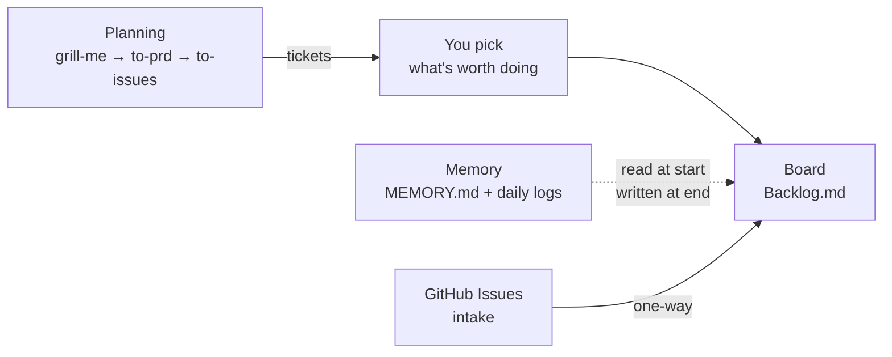

# agentcrew

A setup wizard that turns any git repo into one an agent can work
autonomously — a task board, a memory layer, and a planning loop, wired
together and installed with a single command.



## The rule everything here follows

**No login walls. No hosted services in the critical path. Your data in a
format you own.**

This project previously used a board that required an account for local
issue tracking, then shut down. It was open source — that wasn't enough.
The question that matters is *"can this take my data with it when it dies?"*

Everything here is markdown in your own repo. If every tool in this stack were
abandoned tomorrow, you would lose some nice terminal UIs and keep every task,
decision, and note.

## What gets installed

| Layer | Tool | Where your data lives |
|---|---|---|
| Board | [Backlog.md](https://github.com/MrLesk/Backlog.md) | `backlog/tasks/*.md` |
| Memory | plain markdown | `docs/MEMORY.md`, `memory/*.md` |
| Decisions | `backlog decision` | `backlog/decisions/*.md` |
| Planning | [mattpocock/skills](https://github.com/mattpocock/skills) | `.scratch/<feature>/` |

No database. No server. No account.

## Prerequisites

- git, Node.js ≥ 18, npm
- macOS, Linux, or Windows

## Quickstart

```bash
git clone <your-fork-url> agentcrew
cd agentcrew
node bin/wizard.js setup /path/to/your/project
```

Run it against as many projects as you like. Then:

```bash
node bin/wizard.js update    # re-applies everything to every registered project
```

## What `setup` does

1. Checks prerequisites and detects which agent CLIs you have (`claude`,
   `gemini`, `kimi`, `codex`, `cursor-agent`).
2. Installs Backlog.md and runs `backlog init`, which writes `CLAUDE.md`,
   `AGENTS.md`, and `GEMINI.md` so every agent gets the same instructions.
   Adds a **`Needs Attention`** status — the one column that means "a human
   is needed", whether the work finished or got stuck.
3. Scaffolds the memory layer: `docs/MEMORY.md` and `memory/`.
4. Merges the agentcrew block into all three agent instruction files.
5. Installs the planning skills.
6. Registers the project in `~/.agentcrew/state.json`.

Every step is idempotent. Re-running never duplicates a block, never
overwrites an existing `MEMORY.md`, and never touches your tasks.

## The memory layer

Split by **retention**, not by topic — so what loads each session stays flat
no matter how long the project runs.

| Tier | Where | Loaded |
|---|---|---|
| long-term | `docs/MEMORY.md` | every session (kept under ~200 lines) |
| decisions | `backlog decision list` | on demand |
| short-term | `memory/YYYY-MM-DD.md` | today + yesterday only |
| tasks | `backlog task list` | on demand |

Write to the daily log freely — it's append-only and disposable. Anything
still true in a month gets promoted into `docs/MEMORY.md`; the rest is
dropped. Deleting old logs is safe, because git keeps them.

This follows [OpenClaw's memory model](https://docs.openclaw.ai/concepts/memory).
Cline's Memory Bank is the better-known alternative, but it splits by topic
and reads every file on every task — which gets more expensive as a project
grows, rather than staying flat.

## Tasks vs. GitHub issues

```
GitHub Issues  →  intake. Bugs, requests, anything a human files.
      │
      │  one-way, manual, when you decide to work it
      ↓
Backlog.md     →  execution. In-repo, offline, versioned with the code.
```

Nothing syncs back. Two systems that both claim to know "what's being worked
on" will eventually disagree, and then neither can be trusted.

## Known manual steps (deliberate, not gaps)

- **`/setup-matt-pocock-skills`** — a prompt-driven skill. It reads your repo
  and makes judgment calls; that needs an LLM, not a shell script.
- **Filling in `docs/MEMORY.md`** — the wizard creates the file with a
  template. What goes in it is yours to write.

## Status

The board and memory layer work and are verified against a real install.
**The daemon does not exist yet** — consolidation and worktree launching are
still manual. See `docs/MEMORY.md` for what's verified and what isn't.
