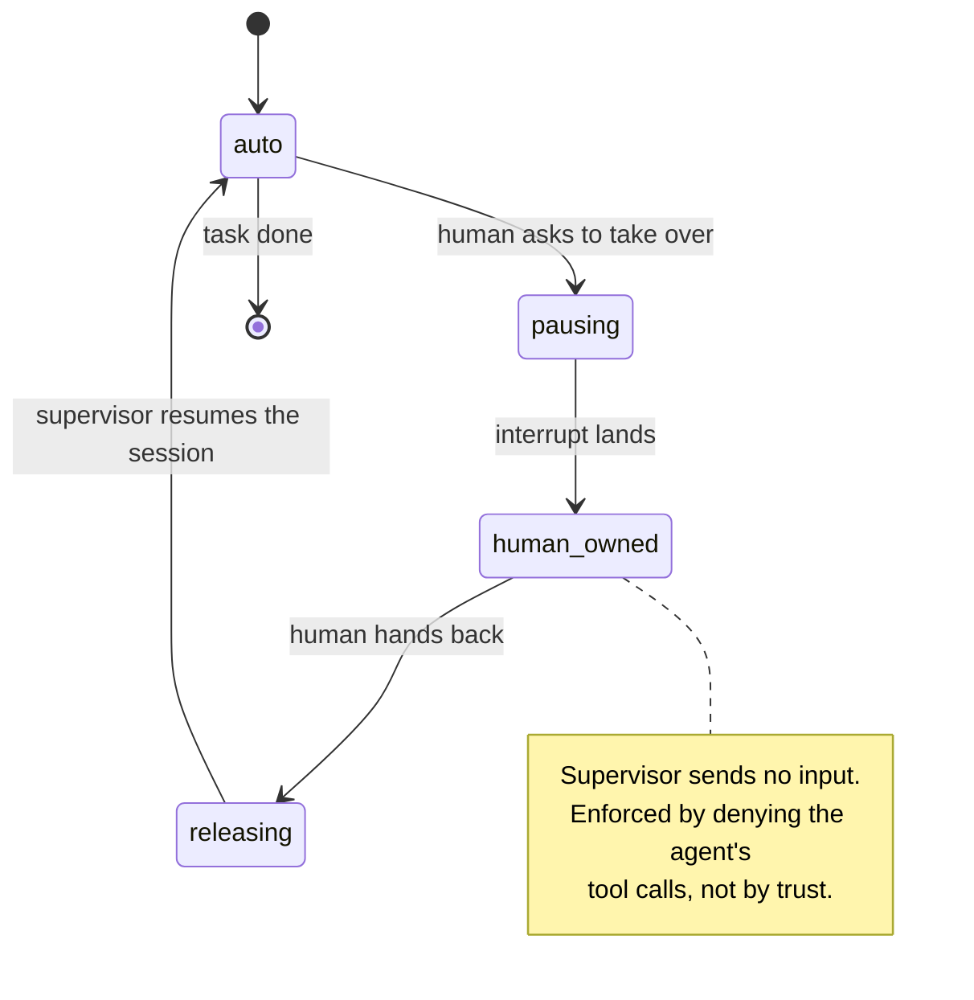

## Context

Supersedes decision-1. The forcing requirement is **human takeover of a running
session**: a person watching the board sees an agent stuck and takes the wheel.
You cannot hand a human a session that another program owns internally, so
agentcrew must own the session lifecycle. Once it does, an external
orchestrator adds little.

Three CLIs converge on the same shape, which makes one supervisor viable:
`--session-id <uuid>`, `--resume`, `--input-format stream-json`,
`--output-format stream-json`, and lifecycle hooks.

## Decision

agentcrew becomes a platform, not only an installer. It supervises agent
sessions, monitors their health, streams their conversations, and lets a human
take over mid-task.

**Spine.** Adapters normalise each CLI into agentcrew's own event schema. An
OpenAI-compatible facade may be added later as an output adapter above the bus,
never in the hot path: chat completions cannot represent a permission request,
a tool event, a session id or cost, which are exactly the signals the system
runs on.

**Two axes, never conflated.**

```text
adapter  = which CLI      claude | agy | gemini | mock
runtime  = where it runs  local process | git worktree | docker | ssh
```

Only `local` ships first. Docker is a future runtime, not a future adapter, and
keeping the seam now avoids rewriting every adapter later.

**Transport** is the CLI's own stdio, not a vendor SDK, per decision-2.
Session identity is a UUID agentcrew mints and passes as `--session-id`. There
is no message hashing.

**Health is an enum**, not a boolean: `working`, `waiting_for_input`,
`rate_limited`, `stuck`, `crashed`, `done`. Detection is tiered, cheapest first:

1. Hook pushes: `Notification` with `agent_needs_input`, `permission_prompt`,
   `idle_prompt`; plus `Stop` and `SessionEnd`.
2. Deterministic stream analysis: repeated identical tool input, no file
   changes across turns.
3. An LLM watchdog, one-shot and stateless, only on escalation from above.
4. A wall-clock watchdog as the liveness net under all of it.

Busy is supervisor-owned state. Streaming input queues messages rather than
rejecting them, so there is no backpressure to read; feed the flag from
`--replay-user-messages` acknowledgements, turn `result` events and hooks.

**Takeover is a state machine**, not a button. While `human_owned` the
supervisor sends no input, and enforcement is a `PreToolUse` deny rather than
trust. Every transition is an event naming the actor.



**Forensics ship as schema in phase 1**, as UI later. Every event carries
`caused_by`. Every process and turn carries `started_by` and `ended_by` as
`{reason, actor, caused_by}`. Causality cannot be backfilled, so the fields
exist before anything reads them.

## Consequences

- agentcrew is full tier only. Nothing here needs admin rights
  (`npm config set prefix ~/.local` covers the global install). The real
  constraints on a locked-down machine are no Node, a TLS-intercepting proxy,
  account policy, endpoint protection killing daemons, and port binding. This
  corrects MEMORY.md decision 4: the constraint is **which CLI is permitted**,
  not install rights.
- Adapter order is `claude`, then `agy`. Gemini CLI is retained as a mocked
  adapter for legacy corporate users, see decision-6.
- Known traps, recorded so they are not rediscovered: never pass `--bare`,
  because it skips hook discovery and removes tier 1 entirely; keep the
  wall-clock timeout above `CLAUDE_CODE_PRINT_BG_WAIT_CEILING_MS`, ten minutes
  by default, or the supervisor fights the CLI's own waiting; verify liveness
  against a nonce the child writes at `SessionStart`, never a bare pid, because
  pids are reused.
- `src/daemon/` keeps memory consolidation into `MEMORY.proposed.md` and gains
  the markdown side of the board bridge.
- Upstream protocol drift is now a first-class risk, handled by decision-6.
