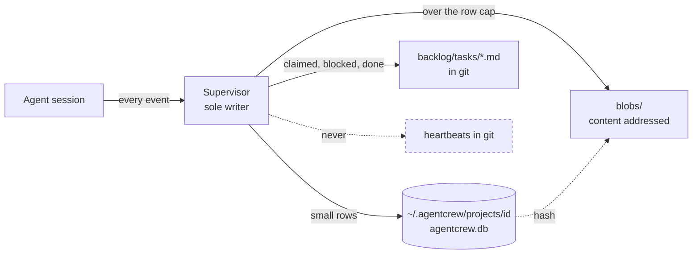

## Context

Markdown was chosen for tasks because a database is hostile to humans and to
agents reading a repo. That argument does not extend to transcripts. A
supervisor that archives every conversation, every process and every health
verdict produces append-only, machine-queried, never-hand-edited data at a rate
git cannot absorb. Committing a heartbeat every few seconds is not versioning,
it is vandalism.

Storing that database inside the project is also unsafe: `git clean -xdf`
deletes it.

## Decision

Split state by **intent versus events**.

| | Intent | Events |
|---|---|---|
| Examples | tasks, decisions, memory | transcripts, process rows, health verdicts, heartbeats |
| Edited by | humans, reviewed | machines, append-only |
| Lives in | markdown in the repo | SQLite outside the repo |
| Written by | humans and the bridge | the daemon, sole writer |

Markdown receives coarse transitions only: claimed, blocked, done. Heartbeats
and live status never touch git.

**Location.** `~/.agentcrew/projects/<project-id>/agentcrew.db`, with `blobs/`
beside it and a registry alongside holding id, path, port, pid and last seen.

**Project identity** is a UUID stored inside `.git/`, resolved through
`git rev-parse --git-common-dir` so worktrees map to their parent rather than
minting new ids.

- Survives `git clean -xdf`, which never touches `.git/`.
- Moves with the directory, so history is not orphaned by a rename.
- Distinct per clone, so two checkouts do not share a database.
- Never committed, so it cannot be inherited by someone else's clone.
- Non-git folders fall back to a dotfile plus path.

**Orphans are never auto-deleted.** A registry entry whose path no longer
resolves becomes `unreachable`. The UI offers relocate or delete, and deletion
requires typed confirmation. A moved project self-heals on next open, because
the id travelled inside `.git/`.

**Scale rule.** The events table stores small rows only. Large tool payloads,
diffs and logs spill to content-addressed files under `blobs/` with only the
hash in the row. When a session closes and ages out, roll its events into one
compressed archive per session, delete them from the hot table, and keep the
summary row forever. Archived, never deleted, matching the memory policy.

**One daemon per project**, sole writer, WAL, its own UI port recorded in the
registry, and a lock file so a second daemon for the same project refuses to
start. The web UI is a separate process that reads many databases and unions in
application code.

## Consequences

- Cross-project views are an application-layer union, not a SQL join. Accepted.
- No Postgres. A service in the critical path fails the selection criterion.
- Deleting a repo leaves history behind on purpose, surfaced rather than
  silently reaped, because a missing path usually means a move.
- Process and health rows outlive transcript blobs. They are tiny and they are
  what gets read weeks later.
