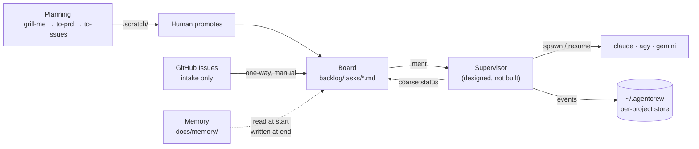

# agentcrew — Project Memory

Long-term memory. Loaded at the start of every session. Kept distilled — if it
grows past ~200 lines, move detail into `backlog decision` entries.

## What this is

`agentcrew setup <path>` turns any git repo into one an agent can work
autonomously: a task board, a memory layer, and a planning loop. It is a
**reusable installer** — run once per repo, and `agentcrew update` re-applies
improvements across every repo registered in `~/.agentcrew/state.json`.

Since decision-3 it is also becoming a **platform**: a supervisor that owns
agent sessions, watches their health, archives every conversation, and lets a
human take the wheel mid-task. The installer remains; it is no longer the
whole product. None of the supervisor is built yet.



## The selection criterion (this is the load-bearing one)

Every dependency must satisfy: **no login wall, no hosted component in the
critical path, data in a format we own, and it still works if the maintainer
disappears tomorrow.**

This came from being burned. The stack originally used Vibe Kanban, which
required a login for local issue tracking and then announced its company was
shutting down. It was *open source* and still failed, so "open source" is not
the filter. The filter is **"can this take my data with it when it dies."**

Backlog.md passes: tasks are markdown in your own repo. If it is abandoned,
you lose a TUI and keep every task.

## Load-bearing decisions

1. **Backlog.md owns execution; GitHub issues are intake only.** Promotion is
   one-way and manual, and nothing syncs back. Two systems that both claim to
   know "what's being worked on" will eventually disagree.
2. **Memory is markdown, not a service.** Split by *retention*, not topic, all
   under `docs/memory/`. Modelled on OpenClaw's design. Cline's Memory Bank
   splits by topic and reads everything every session, deliberately not copied,
   because that gets more expensive as a project grows.
3. **ADRs are Backlog.md's `decision` command**, not a hand-rolled
   `docs/decisions/`. It ships one, indexed by `backlog search`.
4. **Agent-agnostic is a hard requirement, not a preference.** The maintainer
   uses Claude + Kimi personally and *only* Gemini on a corporate machine.
   Anything that hardcodes one agent is disqualified, which is why enforcement
   lives in markdown instructions rather than Claude Code hooks.
   *Corrected 2026-09-19 (decision-3):* the constraint is **which CLI is
   permitted and present**, not install rights. Nothing needs admin;
   `npm config set prefix ~/.local` covers the global install. The real
   blockers on a locked-down machine are no Node, a TLS-intercepting proxy,
   account policy, endpoint protection killing daemons, and port binding.
5. **Validate before designing.** The previous iteration designed an entire
   wizard around Vibe Kanban and guild without running either. Backlog.md was
   spiked against a real install *before* any code was written against it,
   which immediately caught that `--json` doesn't exist (it's `--plain`).
6. **AGENTS.md is the only rules file.** `CLAUDE.md` and `GEMINI.md` are
   one-line `@AGENTS.md` redirects, not copies. Both CLIs expand `@file`, so
   the redirect is an import. `mergeAgentsMd` folds hand-written rules out of
   the redirected files into `AGENTS.md` before overwriting them.
7. **Short-term memory is archived, never deleted.** Old day sections move to
   `docs/memory/archived/session_YYYY_MM_DD.md` and are linked from the archive
   index. Git would keep deleted logs, but nothing would ever look there.
   Enforcement is markdown policy in `templates/AGENTS.snippet.md`, per
   decision 4.
8. **agentcrew dogfoods its own board.** ADRs live in `backlog/decisions/`.
   Read them, don't re-derive them.

| ADR | Says |
|---|---|
| decision-1 | adopt Hermes as orchestrator — **superseded** by decision-3 |
| decision-2 | never proxy vendor credentials; drive the official binaries |
| decision-3 | agentcrew *is* the orchestrator; takeover is the forcing need |
| decision-4 | intent in markdown, events in a store outside the repo |
| decision-5 | interrupts in-band first; signals are a per-OS runtime concern |
| decision-6 | mocked CLIs in tests; no vendor credentials in CI |

## Verified facts

Spiked against backlog.md **v1.48.0**. The CLI now resolves to v1.52.0, so
re-spike before trusting this block.

- Install: `npm install -g backlog.md`. 2 packages, ~3s. Cross-platform.
- `backlog init` is non-interactive with
  `--agent-instructions claude,agents,gemini --integration-mode cli`, and
  writes all three agent files. `--integration-mode none` writes none, which
  is how agentcrew's own board was initialised.
- It manages its own `<!-- BACKLOG.MD GUIDELINES START -->` block with a
  version stamp and upgrades in place. Our `<!-- agentcrew:start -->` block
  coexists with it.
- Tasks are `backlog/tasks/task-N - Title.md`, YAML frontmatter plus marker
  sections. **A status change rewrites one frontmatter line and bumps
  `updated_date`; the file is not moved or renamed.** That is the event the
  daemon watches.
- Statuses are configurable. `Needs Attention` is added by the wizard.
- Machine-readable output is `--plain`. **There is no `--json`.**
- `backlog decision create` takes only a title and status; bodies are written
  to the file afterwards, since there is no `decision edit`.
- MCP server: `backlog mcp start`, stdio transport, real JSON-RPC.
- Backlog.md forbids editing its files directly, so: **watch the files, write
  through the CLI.**

## The daemon

`agentcrew daemon <path>` watches `backlog/tasks/*.md` and reacts to status
transitions.

- `fs.watch` for latency plus a 30s sweep for correctness, because `fs.watch`
  is unreliable on network mounts and some container filesystems. Changes are
  debounced 250ms.
- Baseline is read from disk at startup rather than persisted, so a restart
  never replays old transitions. Transitions while it is stopped are missed by
  design.
- **Consolidation writes `docs/memory/MEMORY.proposed.md`, never `MEMORY.md`.**
  Appending to a log is safe; consolidation is lossy on purpose, so a human
  accepts the drop. This asymmetry is load-bearing, not politeness.

Decision-3 gives the daemon a second half, the session supervisor, which
*does* hold state: a per-project SQLite store outside the repo (decision-4).
The old rule survives in spirit — intent still lives in the repo, so stopping
the daemon loses automation and event history, never tasks.

## Not yet done

- **The supervisor slice.** Designed in decision-3 through decision-6, sitting
  on the board as the `Supervisor v1` milestone, task-1 through task-10.
  Nothing built. Two entry points, run in parallel: task-10, a clickable
  mockup that settles the screens and seeds the event schema, and task-1, a
  protocol spike, because decision-5 rests on an in-band interrupt that is
  undocumented for the raw CLI. Everything else depends on one of them.
- **Worktree isolation and agent launching.** Now framed as the `worktree`
  runtime in decision-3's adapter/runtime split.
- **Nothing is auto-committed.** The daemon writes files; it doesn't commit or
  open PRs.
- **Only `claude -p` is verified.** Gemini, Kimi, Codex and Cursor flags in
  `src/daemon/agents.js` are best-effort and marked `verified: false`.
- **Windows.** The code is Windows-capable but has only been run on Linux, and
  decision-5 makes Windows behaviour genuinely divergent.
- `/setup-matt-pocock-skills` and filling in `docs/memory/MEMORY.md` stay
  manual. Both need judgment a script doesn't have.

## Memory layout (since 0.5.0)

```text
docs/memory/
  MEMORY.md              long-term, distilled, always loaded, ~200 lines
  MEMORY_SHORTTERM.md    archive index + active `## YYYY-MM-DD` sections
  MEMORY.proposed.md     consolidation output; a human accepts it
  archived/
    session_YYYY_MM_DD.md   retired sections, whole and untouched
```

`agentcrew setup` migrates the pre-0.5 layout on re-run, and nothing is
deleted.

## Repo map

| Path | Role |
|---|---|
| `backlog/decisions/` | agentcrew's own ADRs; the repo dogfoods its board |
| `backlog/tasks/` | agentcrew's own board; `Supervisor v1` is task-1..10 |
| `bin/wizard.js` | CLI entry: `setup <path>`, `update`, `daemon` |
| `src/lib/` | shell helpers, state registry (`~/.agentcrew/state.json`) |
| `src/lib/memory.js` | memory paths, day-section parsing, archive index |
| `src/steps/` | one file per setup step, run in order by the wizard |
| `src/steps/mergeAgentsMd.js` | writes AGENTS.md; redirects CLAUDE.md and GEMINI.md |
| `src/daemon/` | board watcher, journal, consolidation, agent invocation |
| `templates/` | the AGENTS block and memory files injected into onboarded repos |
