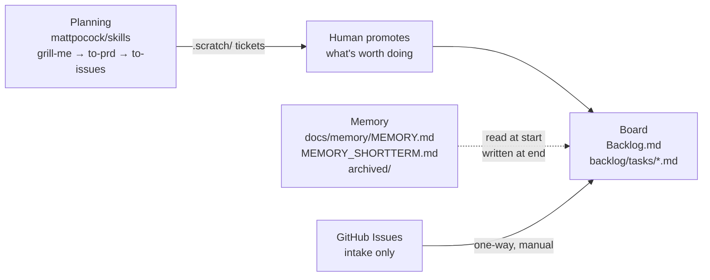

# agentcrew — Project Memory

Long-term memory. Loaded at the start of every session. Kept distilled — if it
grows past ~200 lines, move detail into `backlog decision` entries.

## What this is

A setup wizard (`agentcrew setup <path>`) that turns any git repo into a
project an agent can work autonomously: a task board, a memory layer, and a
planning loop. It is a **reusable installer**, not a scaffold for one project
— run once per repo, and `agentcrew update` re-applies improvements across
every repo registered in `~/.agentcrew/state.json`.



## The selection criterion (this is the load-bearing one)

Every dependency must satisfy: **no login wall, no hosted component in the
critical path, data in a format we own, and it still works if the maintainer
disappears tomorrow.**

This came from being burned: the stack originally used Vibe Kanban, which
required a login for local issue tracking and then announced its company was
shutting down. Note that Vibe Kanban was *open source* and still failed —
"open source" is not the filter. The filter is **"can this take my data with
it when it dies."**

Backlog.md passes because tasks are markdown in your own repo. If it is
abandoned, you lose a TUI and keep every task.

## Load-bearing decisions

1. **Backlog.md owns execution; GitHub issues are intake only.** Promotion is
   one-way and manual, and nothing syncs back. Two systems that both claim to
   know "what's being worked on" will eventually disagree.
2. **Memory is markdown, not a service.** Split by *retention*, not by topic,
   and all of it under `docs/memory/`:
   `MEMORY.md` (long-term, always loaded, capped),
   `MEMORY_SHORTTERM.md` (short-term, append-only, one `## YYYY-MM-DD` section
   per day, only the recent ones read), `archived/session_*.md` (retired log
   batches, read on demand). Modelled on OpenClaw's memory design. Cline's
   Memory Bank splits by topic and reads everything every session —
   deliberately not copied, because it gets more expensive as a project grows.
   Since 0.5.0 the short-term tier is one file rather than one file per day:
   an agent skims recent sections in a single read, and cleanup is a defined
   workflow instead of a judgement call about which files to delete.
3. **ADRs are Backlog.md's `decision` command**, not a hand-rolled
   `docs/decisions/`. It ships one, indexed by `backlog search` alongside
   tasks and docs.
4. **Agent-agnostic is a hard requirement, not a preference.** The maintainer
   uses Claude + Kimi personally and *only* Gemini on a corporate machine.
   Anything that hardcodes one agent, or needs install rights a corporate
   machine won't grant, is disqualified. This is why enforcement lives in
   markdown instructions rather than Claude Code hooks.
5. **Validate before designing.** The previous iteration designed an entire
   wizard around Vibe Kanban and guild without ever running either. Backlog.md
   was spiked against a real install *before* any code was written against it
   — which immediately caught that `--json` doesn't exist (it's `--plain`).
6. **AGENTS.md is the only rules file.** `CLAUDE.md` and `GEMINI.md` are
   one-line `@AGENTS.md` redirects, not copies — three files with the same
   rules drift, and the drift is invisible until an agent behaves differently
   depending on which one it read. Both CLIs expand `@file`, so the redirect
   is an import, not a suggestion. `mergeAgentsMd` folds hand-written rules
   out of the redirected files into `AGENTS.md` before overwriting them.
7. **Short-term memory is archived, never deleted.** Old day sections move to
   `docs/memory/archived/session_YYYY_MM_DD.md` and are linked from the
   short-term file's archive index. Git would keep deleted logs, but nothing
   would ever look there; a linked archive stays reachable. Enforcement is the
   markdown policy in `templates/AGENTS.snippet.md` — no CLI command, per
   decision 4 (agent-agnostic, no install rights needed).
8. **Orchestration and credentials are settled in `backlog/decisions/`.**
   agentcrew now runs its own board, so ADRs live where the tool indexes them.
   `decision-1` adopts Hermes Agent as the orchestrator in place of the
   daemon's scheduling ambitions, with markdown kept as the record by fixing
   the direction of flow. `decision-2` forbids proxying vendor credentials and
   routes subscription economics through delegation to the official CLIs
   instead. Both are `proposed`.

## Verified facts (spiked against backlog.md v1.48.0)

- Install: `npm install -g backlog.md`. 2 packages, ~3s. Cross-platform.
- `backlog init` is fully non-interactive with
  `--agent-instructions claude,agents,gemini --integration-mode cli`.
  It writes `CLAUDE.md`, `AGENTS.md`, `GEMINI.md` — all three agents covered.
  agentcrew then collapses that to one: `AGENTS.md` keeps the rules, and the
  other two become one-line `@AGENTS.md` redirects.
- It manages its own marker block (`<!-- BACKLOG.MD GUIDELINES START -->`)
  with a version stamp, so it upgrades in place. We keep a separate
  `<!-- agentcrew:start -->` block; both coexist.
- Tasks are `backlog/tasks/task-N - Title.md`: YAML frontmatter + marker
  sections. **A status change rewrites one frontmatter line and bumps
  `updated_date`; the file is not moved or renamed.** That is the event the
  planned daemon watches.
- Statuses are configurable — `Needs Attention` is added by the wizard,
  reproducing the one Vibe Kanban feature worth keeping.
- Machine-readable output is `--plain`. **There is no `--json`.**
- MCP server: `backlog mcp start`, stdio transport, real JSON-RPC.
- Backlog.md forbids editing its files directly ("use the CLI so metadata,
  relationships and history stay consistent"). So: **watch the files, write
  through the CLI.**

## The daemon

`agentcrew daemon <path>` watches `backlog/tasks/*.md` and reacts to status
transitions. It holds **no state of its own** — an in-memory snapshot at
startup, and every output is a file in the repo. Stopping it loses
automation, never data.

- `fs.watch` for latency + a 30s full sweep for correctness, because
  `fs.watch` is unreliable on network mounts and some container filesystems.
  Changes are debounced 250ms since one save fires it several times.
- Baseline is read from disk at startup rather than persisted, so a restart
  never replays old transitions. Transitions occurring while it is stopped
  are missed by design.
- **Consolidation writes `docs/memory/MEMORY.proposed.md`, never `MEMORY.md`.**
  Appending to a daily log is safe; consolidation is lossy on purpose. A
  human accepts the drop. This asymmetry is load-bearing, not politeness.

## Not yet done

- **Worktree isolation and agent launching.** Moving a task to `In Progress`
  is journalled but doesn't yet create a worktree and start an agent in it.
  This is the remaining gap versus the original goal.
- **Nothing is auto-committed.** The daemon writes files; it doesn't commit
  or open PRs. The intended end state is auto-commit for journal appends and
  a PR for MEMORY.md rewrites.
- **Only `claude -p` is verified.** Gemini, Kimi, Codex and Cursor flags in
  `src/daemon/agents.js` are best-effort defaults, marked
  `verified: false`, and overridable per-machine.
- **Windows and Gemini-CLI verification.** The code is now Windows-capable
  (no shell builtins, `.cmd` shims handled) but has only been run on Linux.
- `/setup-matt-pocock-skills` and filling in `docs/MEMORY.md` are
  deliberately manual — both need judgment a script doesn't have.

## Memory layout (since 0.5.0)

```text
docs/memory/
  MEMORY.md              long-term, distilled, always loaded, ~200 lines
  MEMORY_SHORTTERM.md    archive index + active `## YYYY-MM-DD` sections
  MEMORY.proposed.md     consolidation output; a human accepts it
  archived/
    session_YYYY_MM_DD.md   retired sections, whole and untouched
```

`agentcrew setup` migrates the pre-0.5 layout on re-run: `docs/MEMORY.md` moves
to `docs/memory/MEMORY.md`, and each `memory/YYYY-MM-DD.md` becomes an archived
session linked from the index. Nothing is deleted, and re-running is a no-op.

## Repo map

| Path | Role |
|---|---|
| `backlog/decisions/` | agentcrew's own ADRs; the repo now dogfoods its board |
| `bin/wizard.js` | CLI entry: `setup <path>`, `update` |
| `src/lib/` | shell helpers, state registry (`~/.agentcrew/state.json`) |
| `src/steps/` | one file per setup step, run in order by the wizard |
| `src/daemon/` | board watcher, journal, consolidation, agent invocation |
| `src/lib/memory.js` | memory-layer paths, day-section parsing, archive index |
| `src/steps/mergeAgentsMd.js` | writes AGENTS.md; redirects CLAUDE.md and GEMINI.md to it |
| `templates/AGENTS.snippet.md` | the memory/task boundary injected into every onboarded repo |
| `templates/MEMORY.template.md` | starting `docs/memory/MEMORY.md` for onboarded repos |
| `templates/MEMORY_SHORTTERM.template.md` | starting short-term log, with the archiving policy |
| `templates/ARCHIVED.readme.md` | README dropped into `docs/memory/archived/` |
